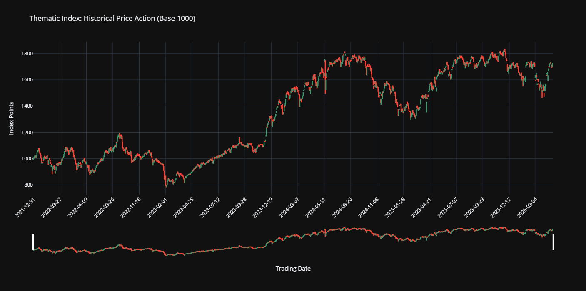
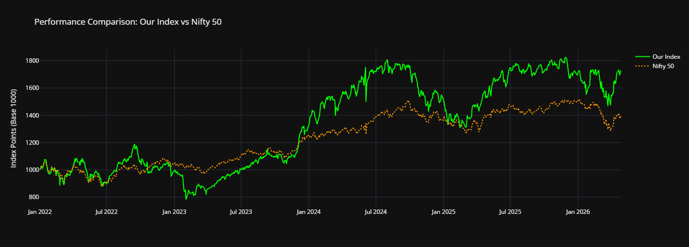
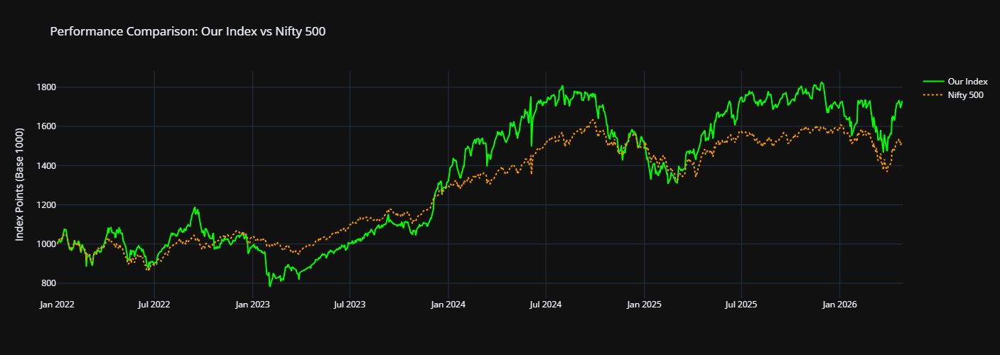

# 📈 Customized Thematic Index Creation
**An Institutional-Grade Engine for Backtesting NSE Thematic Indices**

This repository provides a complete, end-to-end framework for building and analyzing customized thematic indices listed on the **National Stock Exchange (NSE)** of India.

---

## 📖 The Core: Self-Explaining Notebook
The heart of this project is the **[`index.ipynb`](https://github.com/r-biswas/customised-index-creation/blob/main/index.ipynb)**. 

The notebook is designed to be **entirely self-explanatory**. It takes you through the full journey of an index—from selecting stocks and applying liquidity rules to building the final price charts. Each section contains its own logic, math, and interactive charts.

### **📊 Visual Results**
Below are the captures from our current run (Transport & Logistics Theme):

| Index Performance | Comparison vs Nifty 50 | Comparison vs Nifty 500 |
|:---:|:---:|:---:|
|  |  |  |

---

## 📁 Repository Structure
To keep the analysis robust and reproducible, the repo is organized as follows:
- **`index.ipynb`**: The main research engine. Read this to understand the methodology.
- **`result_capture/`**: High-resolution exports of the index performance and benchmarks.
- **`ohlc/`**: Local cache of daily price and volume data for candidate stocks.
- **`shareholding/`**: Historical public holding data used for free-float calculations.
- **`stock_mega_masterlist.csv`**: The "Seed" file containing industry metadata for thematic filtering.
- **`fetch_shareholding_nse.py`**: A specialized utility script used by the notebook to sync fundamental data from NSE.
- **`index_candlestick.csv`**: The daily OHLC output of the constructed index.

---

## 🛠️ How to Run Locally
If you want to try your own thematic keywords or different rebalancing rules:

1.  **Clone the Repo:**
    ```bash
    git clone https://github.com/r-biswas/customised-index-creation.git
    ```
2.  **Open the Notebook:**
    Launch Jupyter Lab or VS Code and open `index.ipynb`.
3.  **One-Click Setup:**
    The very first cell in the notebook is an **Environment Setup** cell. Run it, and it will automatically install all required libraries (`pandas`, `yfinance`, `playwright`, etc.).
4.  **Run All Cells:**
    The engine is designed to be "Run All." It will automatically rebuild the data folders if they are missing and generate the latest performance reports.

---

## ✍️ Author
**Ranit Biswas**  
IIT Gandhinagar | [AlgoXR.in](https://AlgoXR.in)  
📧 ranit.biswas@iitgn.ac.in


